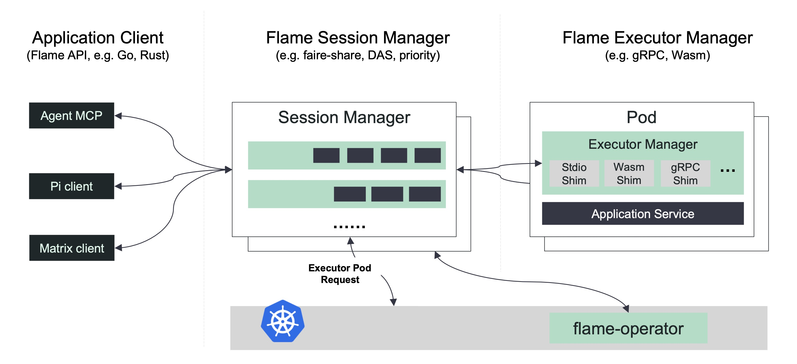

# Flame: A Distributed System for Elastic Workloads

[](http://github.com/flame-sh/flame)
[](http://github.com/flame-sh/flame)
[](https://github.com/flame-sh/flame/releases)
[](https://bestpractices.coreinfrastructure.org/projects/7299)

Flame is a distributed system designed for elastic workloads, providing a comprehensive suite of mechanisms commonly required by various classes of elastic workloads, including AI/ML, HPC, Big Data, and more. Built upon over a decade and a half of experience running diverse high-performance workloads at scale across multiple systems and platforms, Flame incorporates best-of-breed ideas and practices from the open source community.

## Motivation

As elastic workload patterns become increasingly adopted for innovation, a common workload runtime is essential to accelerate these elastic workloads through the following key aspects:

* **Scale**: Unlike applications running on a single node, Flame scales workloads across multiple nodes to maximize performance acceleration while ensuring fair resource sharing across multiple tenants and sessions.
* **Performance**: Elastic workloads typically involve tens of thousands of short tasks. Flame leverages cutting-edge features to improve roundtrip times and throughput in large-scale environments, while intelligently sharing runtime within sessions to minimize startup time.
* **Security**: Flame utilizes microVM as a runtime for enhanced security, with each runtime environment (executor) dedicated to a single session to prevent data leakage. All Flame components communicate using mTLS for secure inter-component communication.
* **Flexibility**: Flame defines a comprehensive set of general APIs to support multiple user scenarios. Additionally, Flame supports applications across multiple programming languages through gRPC, including Rust, Go, and Python.

## Architecture Overview



### Core Concepts

**Session:** A `Session` represents a group of related tasks. The `Session Scheduler` allocates resources to each session based on scheduling configurations by requesting the resource manager (e.g., Kubernetes) to launch executors. Clients can continuously create tasks until the session is closed.

**Task:** A task within a `Session` contains the main algorithm defined by the task's metadata and input/output information (e.g., volume paths).

**Executor:** The Executor manages the lifecycle of Applications/Services, which contain the user's code for executing tasks. Applications are typically not reused between sessions, though images may be reused to avoid repeated downloads.

**Shim:** The protocol implementation used by the Executor to manage applications, supporting various protocols such as gRPC, RESTful APIs, stdio, and more.

### How It Works

Flame accepts connections from user clients and creates `Session`s for jobs. Clients can continuously submit tasks to a session until it's closed, with no predefined replica requirements.

The `Session Scheduler` allocates resources to each session based on scheduling configurations by requesting the resource manager (e.g., Kubernetes) to launch executors.

Executors connect back to Flame via `gRPC` to pull tasks from their related `Session` and reuse the executor. Executors are released/deleted when no more tasks remain in the related session.

Services receive notifications when they're bound or unbound to related sessions, allowing them to take appropriate actions (e.g., connecting to databases). Services can then pull tasks from the `Session` and reuse data to accelerate execution.

Future enhancements to the `Session Scheduler` will include features to improve performance and usage, such as proportional allocation, delayed release, and min/max constraints.

## Quick Start Guide

This guide uses [minikube](https://minikube.sigs.k8s.io/docs/) and [skaffold](https://skaffold.dev/) to start a local Kubernetes cluster with Flame. After installing minikube and skaffold, you can start a local Flame cluster with the following steps:

```shell
$ minikube start --driver=docker
$ skaffold run
```

After the Flame cluster is launched, use the following steps to log into the `flame-console` pod, which serves as a debug tool for both developers and SREs:

```shell
$ CONSOLE_POD=`kubectl get pod -n flame-system | grep flame-console | cut -d" " -f1`
$ kubectl exec -it ${CONSOLE_POD} -n flame-system -- /bin/bash
```

Then, verify the installation with `flmping` in the pod. Additionally, you can explore more meaningful examples [here](examples):

```shell
# flmping -t 10000
Session <4> was created in <0 ms>, start to run <10,000> tasks in the session:

[100%] =============================================   10000/10000

<10,000> tasks was completed in <1,603 ms>.
```

You can check session status using `flmctl` as follows. It also includes several sub-commands, such as `view`:

```shell
# flmctl list
ID        State     App            Slots     Pending   Running   Succeed   Failed    Created
1         Closed    pi             1         0         0         100       0         07:33:58
2         Closed    flmexec        1         0         0         10        0         07:34:12
3         Closed    flmexec        1         0         0         10000     0         07:34:17
4         Closed    flmexec        1         0         0         10000     0         08:34:20
```

## Documentation

* [Estimating the value of Pi using Monte Carlo](docs/blogs/evaluating-pi-by-monte-carlo.md)
* [Estimating the value of Pi using Flame Python Client](docs/blogs/evaluating-pi-by-flame-python.md)

## API Reference

* **Frontend API**: [frontend.proto](rpc/protos/frontend.proto)
* **Shim API**: [shim.proto](rpc/protos/shim.proto)

## Contributing

We welcome contributions! Please see our [contributing guidelines](CONTRIBUTING.md) for more information.

## License

This project is licensed under the terms specified in the [LICENSE](LICENSE) file.

