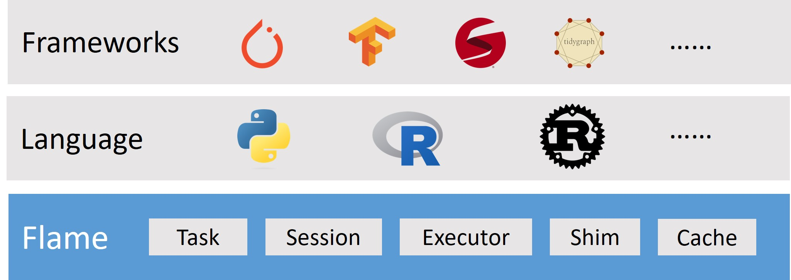

# Flame: A Distributed System for Intelligent Workload

[](http://github.com/xflops/flame)
[](http://github.com/xflops/flame)
[](https://github.com/xflops/flame/releases)

Flame is a distributed system for intelligent workloads; it provides a suite of mechanisms that are commonly required by many classes of intelligent workload, 
including AI/ML, HPC, BigData and so on. Flame builds upon a decade and a half of experience running a wide variety of high performance workloads
at scale using several systems and platforms, combined with best-of-breed ideas and practices from the open source community.

## Motivation

As more and more intelligent workload patten are adopted for the innovation, a common workload runtime is helpful to speed up 
those intelligent workloads by following aspects:  

* **Scale**: Compared to the application in a single node, the Flame will scale up the workload to multiple nodes as much as possible to speed up it, e.g. distributed training; and it makes sure the resources are shared fairly between multiple tenants.   
* **Data sharing**: Data is one of key factor for intelligent workload; the Flame will schedule not only the workload, but also the data. A distributed cached will be introduced in Flame, and it will schedule data & resources together to improve data sharing.  
* **Mix workloads**: Batch (e.g. MPI) and Elastic are two major pattern for intelligent workloads, the Flame will manage those two kind of workload together by migrating 'message passing' to 'data driven'.
* **Roundtrip/Throughput**: Usually, intelligent workload includes tens of thousands of short tasks; the Flame leverages the latest features (e.g. Future, CondVar) to improve roundtrip and throughput in a large scale environment.

## Overall Architecture



### Terminologies

**Session:** One `Session` represents a group of tasks of a job, the `Session Scheduler` will allocate resources to each session based on scheduling configurations, by asking for resource manager (e.g. Kubernetes) to launch executors.

**Task:** The task of `Session` which includes the major algorithm of the job by task's metadata and input/output info, e.g. volume path.

**Executor:** The Executor will handle the lifecycle management of Application/Service which is user's code to execute tasks. Usually, the applications are not reused between sessions, but the image maybe reused to avoid download.

**Shim:** The protocol implementation of Executor to manage application, e.g. gRPC, Restful, stdio and so on. 

**Cache:** As the data is the key factor of intelligent workload, a distributed cache will be introduced in Flame to schedule data & resources together for better performance.

### Functionality

The Flame will accept connection from user's client, and create `Session`s for the job; the client keeps submit tasks to the session until closing it, pre-defined replica is not necessary.
The `Session Scheduler` will allocate resources to each session based on scheduling configurations, by asking for resource manager (e.g. Kubernetes) to launch executor.
The Executor will connect back to Flame by `gRPC` to pull tasks from related `Session` to reuse executor. The executor will be released/deleted if no more tasks in related session.

The service will get the notification when it's bound or unbound to the related session, so it can take action accordingly, e.g. connecting to database; and then, the service can pull tasks from `Session`,
and reuse those data to speed up execution.

In the future, the `Session scheduler` will provide several features to improve the performance and usage, e.g. proportion, delay release, min/max and so on.

## Quick Start Guide

Currently, the components of Flame are using gRPC to communicate with each other; so it's required to install gRPC to build the Flame.
And supervisor makes it simple to start a Flame cluster with several executors.

```shell
$ sudo apt-get update
$ sudo apt-get install -y protobuf-compiler supervisor
```

As Flame is written by Rust, it's easy to build the project by `cargo` as following command: 

```shell
$ cargo build
```

Supervisor is used to start the Flame cluster, refer to [ci/supervisord.conf](ci/supervisord.conf) for more detail.

```shell
$ supervisord -c ci/supervisord.conf
```

After start the Flame cluster, it's time to verify it with `flmping`. In addition, there are also more meaningful examples [here](example).

```shell
$ ./target/debug/flmping --flame-conf ci/flame-conf.yaml
Create session in <10 ms>, and create <10> tasks in <8 ms>.

Waiting for <10> tasks to complete:
 Total: 10         Succeed: 0          Failed: 0          Pending: 10         Running: 0
 Total: 10         Succeed: 10         Failed: 0          Pending: 0          Running: 0
```

## Reference

* **API**: https://github.com/xflops/flame/blob/main/rpc/protos/flame.proto

